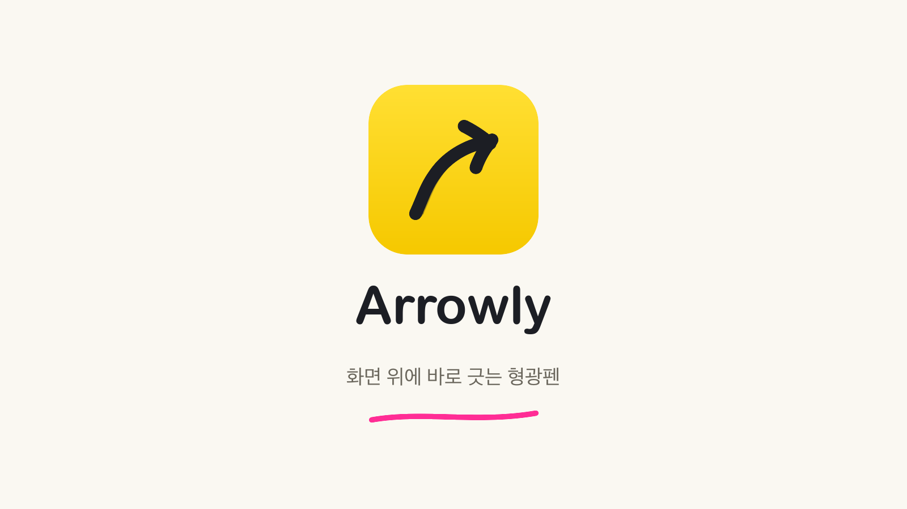
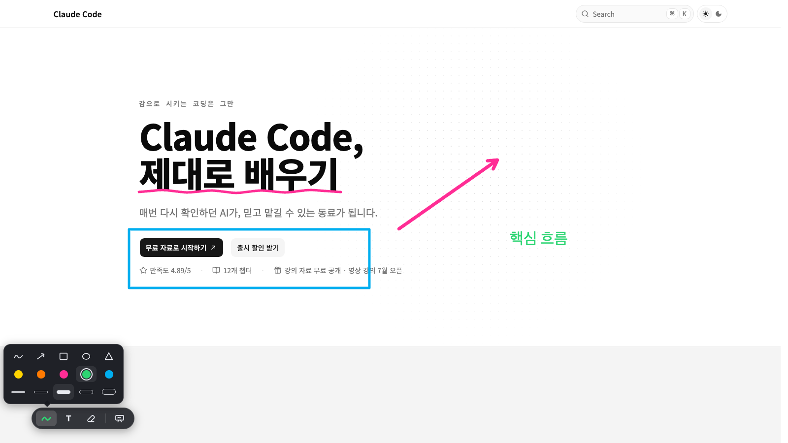

# Arrowly

화면 녹화 중 화면 위에 바로 그리는 macOS 주석 오버레이입니다.
펜 하나로 밑줄·동그라미·화살표를 긋고, 설명이 끝나면 지웁니다.



## 설치

[Releases](https://github.com/toy-crane/arrowly/releases)에서 최신 DMG를 받아 Arrowly를 Applications 폴더로 옮깁니다.

베타 빌드는 서명이 없어 첫 실행 시 경고가 뜹니다. 한 번만 허용하면 됩니다:

- macOS 15 이상: 시스템 설정 → 개인정보 보호 및 보안 → 하단 **그래도 열기**
- macOS 14 이하: 앱 우클릭 → **열기**

## 사용법

| 키 | 동작 |
|---|---|
| ⌥Tab | 그리기 켜기 / 끄기 |
| ⇧⌥Tab | 블랙보드 열기 / 전환 |
| ⌘Z / ⇧⌘Z | 획 취소 / 되살리기 |
| ⌥⌫ | 전체 지우기 |
| T → 클릭 / 빈 곳 더블클릭 | 텍스트 입력 |
| ⌘+ / ⌘− | 편집 중 텍스트 크기 변경 |
| Esc | 텍스트 편집 종료 → 다시 누르면 그리기 종료 |



- 그리기 중 좌하단 마커에서 색·펜 굵기·텍스트 크기를 각각 5단계로 바꿉니다. 드래그로 옮길 수 있습니다.
- 기존 텍스트를 더블클릭하면 내용과 크기를 다시 고칠 수 있습니다. 텍스트의 위치와 색은 유지됩니다.
- 그리기를 끄면 그림은 숨겨지고, 다시 켜면 복원됩니다. 삭제는 ⌘Z·⌥⌫로만 됩니다.
- 그리기·블랙보드·전체 지우기 단축키 변경, 마커 숨기기, 튜토리얼 다시 보기는 메뉴바 아이콘 메뉴에 있습니다.
- 접근성 권한이 필요 없습니다. 그리는 동안에도 아래 앱은 활성 상태로 유지됩니다.

## 제약 (오픈 베타)

- macOS 전용 (Apple Silicon · Intel universal)
- 커서가 있는 모니터 1개만 덮습니다
- 그림은 정지 화면 기준입니다 — 아래 화면 스크롤을 따라가지 않습니다
- 자동 업데이트가 없습니다

버그·의견: [Issues](https://github.com/toy-crane/arrowly/issues)

## 개발

```bash
bun install
bun tauri dev
# 기존 설정을 보존한 채 온보딩만 다시 시작
bun run tauri:fresh
# 테스트·커버리지·빌드 전체 검증
bun run test:all
```

Tauri v2 + React/TypeScript + Bun.
요구사항 [docs/REQUIREMENTS.md](docs/REQUIREMENTS.md) · 테스트 [docs/TESTING.md](docs/TESTING.md) · 릴리스 절차 [docs/RELEASE.md](docs/RELEASE.md)
