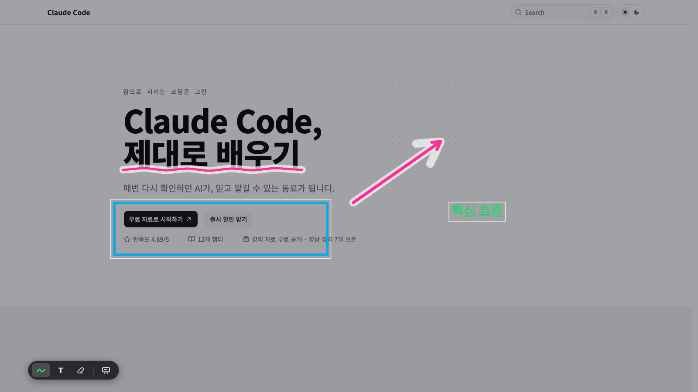

# Arrowly

화면을 바꾸지 않고, 보고 있는 곳에 바로 설명하는 macOS 주석 오버레이입니다.
자유곡선·화살표·도형·텍스트로 표시하고, 잘못 놓은 마크는 즉시 옮기거나 지운 뒤 설명이 끝나면 화면을 비웁니다.

[최신 버전 다운로드](https://github.com/toy-crane/arrowly/releases/latest) · macOS universal (Apple Silicon + Intel)


_실제 사용 예시는 [docs.claude-hunt.com](https://docs.claude-hunt.com) 위에서 촬영했습니다._

## 설치

1. [Releases](https://github.com/toy-crane/arrowly/releases/latest)에서 `Arrowly_0.2.0_universal.dmg`를 받습니다.
2. DMG를 열고 Arrowly를 **Applications** 폴더로 옮깁니다.
3. Arrowly를 실행하면 메뉴바에 아이콘이 나타나고 약 20초의 첫 사용 튜토리얼이 열립니다.

v0.2.0은 Developer ID 서명과 Apple 공증을 마친 빌드라 별도의 보안 예외 없이 실행됩니다. 접근성 권한도 요구하지 않습니다.

## 30초 만에 시작하기

1. `⌥Tab`을 눌러 커서가 있는 화면에서 그리기를 시작합니다.
2. 마우스로 자유롭게 그리고, 좌하단 플로팅 마커에서 화살표·도형·색·굵기·텍스트를 고릅니다.
3. `Esc`를 눌러 원래 화면으로 돌아갑니다.

그리기를 끝내면 마크는 삭제되지 않고 잠시 숨습니다. `⌥Tab`으로 다시 들어오면 복원되며, 현재 장면을 완전히 비우려면 `⌥⌫`을 누릅니다.

## 주요 기능

### 자유롭게 그리고 정확하게 보정

- 자유곡선을 빠르게 그리거나, 획 끝에서 잠시 멈춰 직선·사각형·타원·삼각형으로 보정합니다.
- 화살표·사각형·타원·삼각형 도구를 직접 골라 같은 형태를 연속으로 그릴 수 있습니다.
- 잉크는 5가지 색과 5단계 굵기를 지원합니다. `⌘+`·`⌘−`로 현재 도구 크기를 바로 바꿀 수 있습니다.
- `T`를 누르고 클릭하면 텍스트를 쓰며, 기존 텍스트는 어떤 도구를 사용 중이든 더블클릭해 내용과 크기를 고칠 수 있습니다.

### 마크를 옮기고 필요한 것만 삭제

펜·텍스트·화살표·도형을 모두 `⌘` 드래그로 옮길 수 있습니다. `⌘`을 잠시 누르면 이동할 수 있는 마크가 한꺼번에 드러나고, `⌥` 클릭은 마크 하나를 즉시 지웁니다. 여러 마크를 이어서 지울 때는 `E`로 마크 삭제 도구를 잠급니다.



### 설명에 필요한 순간 기능

- **블랙보드** — `⇧⌥Tab`으로 현재 마크를 유지한 채 배경만 검게 전환합니다.
- **포인터 핑** — 빈 곳이나 텍스트가 아닌 마크를 더블클릭하면 500ms 동안 노란 표시가 퍼지고 흔적은 남지 않습니다.
- **Undo/Redo** — 새 마크, 이동, 텍스트 교정, 삭제를 `⌘Z`·`⇧⌘Z`로 되돌리고 되살립니다.
- **포커스 유지** — 전체화면 앱 위에서도 동작하며, 그리는 동안 아래 앱은 활성 상태를 유지합니다.
- **인터랙티브 온보딩** — 첫 실행에서 그리기, 이동, 삭제, 되돌리기, 전체 지우기와 안전하게 끝내는 방법을 직접 연습합니다.
- **메뉴바 유틸** — 평소에는 Dock을 차지하지 않습니다. 로그인 시 실행, 마커 숨기기, 단축키 설정, 튜토리얼 다시 보기를 메뉴바에서 관리합니다.

## 조작 한눈에 보기

| 조작 | 동작 |
|---|---|
| `⌥Tab` | 그리기 시작·끝내기 |
| `⇧⌥Tab` | 블랙보드 켜기·끄기 |
| `⌥⌫` | 마크 모두 지우기 |
| `T` → 클릭 | 새 텍스트 쓰기 |
| 기존 텍스트 더블클릭 | 텍스트 내용·크기 교정 |
| `Shift+Enter` | 텍스트 입력 중 줄바꿈 |
| `Enter` / 바깥 클릭 | 텍스트 확정 |
| `⌘` + 마크 드래그 | 마크 하나 옮기기 |
| `⌥` + 마크 클릭 | 마크 하나 지우기 |
| `E` | 마크 삭제 도구 잠금·해제 |
| 빈 곳 더블클릭 | 포인터 핑 |
| 자유곡선 끝에서 잠시 유지 | 직선·도형 보정 |
| `⌘Z` / `⇧⌘Z` | 되돌리기 / 다시 실행 |
| `⌘+` / `⌘−` | 현재 도구 굵기 또는 텍스트 크기 조절 |
| `Esc` | 텍스트 편집 종료 → 다시 누르면 그리기 종료 |

`⌥Tab`, `⇧⌥Tab`, `⌥⌫`, `T`는 **단축키와 제스처** 설정에서 바꿀 수 있습니다. 나머지는 항상 같은 고정 조작입니다.

## 현재 범위와 제약

- macOS 전용이며 Apple Silicon과 Intel을 모두 지원합니다.
- 그리기를 시작할 때 커서가 있는 모니터 하나만 덮습니다.
- 마크는 화면 좌표에 남으므로 아래 화면의 스크롤이나 창 이동을 따라가지 않습니다.
- 마크 저장·불러오기, 여러 페이지, 여러 마크 동시 선택은 제공하지 않습니다.
- 앱을 재시작하면 마크와 블랙보드 상태가 초기화됩니다.
- 자동 업데이트가 없어 새 버전은 Releases에서 다시 받아야 합니다.

버그와 제안은 [Issues](https://github.com/toy-crane/arrowly/issues)에 남겨주세요.

## 개발

Rust와 Bun, Xcode Command Line Tools가 필요합니다.

```bash
bun install

# 네이티브 macOS 앱 실행
bun run tauri dev

# 온보딩부터 다시 실행
bun run tauri:fresh

# 의존 경계·프런트/Rust 커버리지·빌드 전체 검증
bun run test:all
```

Arrowly는 Tauri v2 + React/TypeScript + Bun으로 만듭니다.

- 제품 경계: [docs/specs/product-boundary/spec.md](docs/specs/product-boundary/spec.md)
- 기능 스펙: [docs/specs](docs/specs)
- 릴리스 절차: [docs/RELEASE.md](docs/RELEASE.md)
